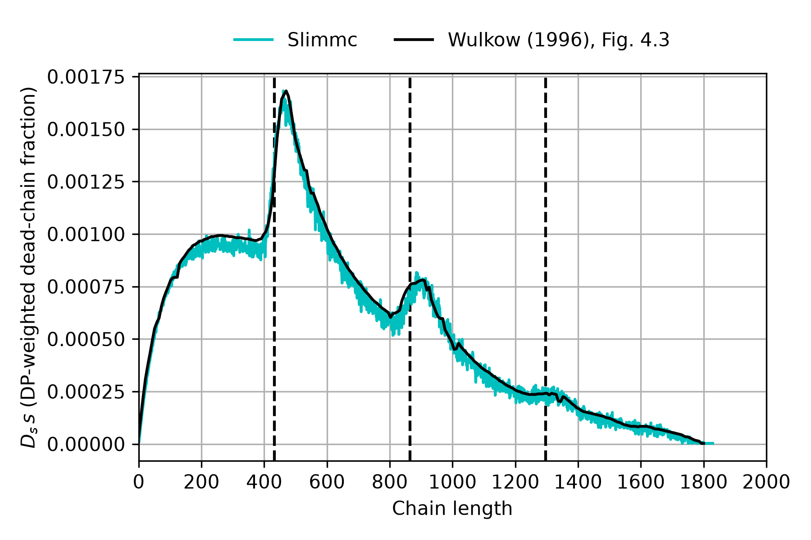

# slimmc-case-studies

#### The repository contains scientific case studies, validation exercises, and literature-based benchmarks for [slimmc](https://github.com/sbednarz/slimmc), a stochastic kinetic Monte Carlo simulator for radical polymerization.

See also:
[`slimmc-examples`](https://github.com/sbednarz/slimmc-examples) - small teaching workflows for [slimmc](https://github.com/sbednarz/slimmc).

## Index

| ID | Graph | Case study | Description |
|---:|:---:|---|---|
| [A01](cases/A01_PLP_Buback_1996/) |  | M. Buback, M. Busch, R. A. Lämmel, "Modeling of molecular weight distribution in pulsed laser free-radical homopolymerizations," *Macromolecular Theory and Simulations* **5** (1996) 845–861. https://doi.org/10.1002/mats.1996.040050505 | Reproduction of the characteristic PLP structure of the MWD |
| [A02](cases/A02_PLP_Wulkow_1996/) |  | M. Wulkow, "PREDICI - A Software Package for Real-life Polymerisation Kinetics," in Progress in Industrial Mathematics at ECMI 94, H. Neunzert (ed.), John Wiley & Sons / B. G. Teubner, 1996, pp. 166–175. https://doi.org/10.1007/978-3-322-82967-2_20| Reproduction of the characteristic PLP structure of the MWD |
| [A03](cases/A03_PLP_Vana_2002/) |  | P. Vana, L. H. Yee, C. Barner-Kowollik, J. P. A. Heuts, and T. P. Davis, "Termination Rate Coefficient of Dimethyl Itaconate: Comparison of Modeling and Experimental Results,"  *Macromolecules*, **35** (2002), 1651–1657. |


## Running case studies

Tool commands are configured once in `config.mk`:

```make
SLIMMC ?= slimmc
PYTHON ?= python
```

Use:

```bash
make        # show available commands
make list   # list case studies
make all    # run all case studies
make clean  # remove generated results
make A01_case_name
```

Each numbered directory owns its own small `Makefile`, where `all` means
`check`, `run`, then `analyze`.


## Directory convention

```text
cases/LNN_short_name/
├── README.md
├── Makefile
├── *.model
├── analyze.py
```


