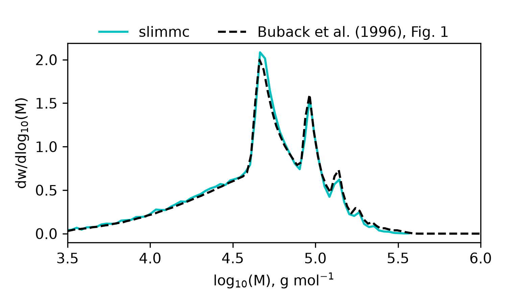

# slimmc-case-studies

Scientific case studies, validation exercises, and literature-based benchmarks
for [slimmc](https://github.com/sbednarz/slimmc), a stochastic kinetic Monte Carlo simulator for radical polymerization.
This repository complements
[`slimmc-examples`](https://github.com/sbednarz/slimmc-examples). Examples are
small teaching workflows; case studies should document the scientific source,
assumptions, parameter provenance, comparison target, and interpretation of the
result.

## Index

| ID | Graph | Case study | Description |
|---:|:---:|---|---|
| [A01](cases/A01_PLP_Buback_1996/) |  | M. Buback, M. Busch, R. A. Lämmel, “Modeling of molecular weight distribution in pulsed laser free-radical homopolymerizations,” *Macromolecular Theory and Simulations* **5** (1996) 845–861. https://doi.org/10.1002/mats.1996.040050505 | Reproduction of the characteristic PLP structure of the MWD |

## Running case studies

Tool commands are configured once in `config.mk`:

```make
SLIMMC ?= slimmc
PYTHON ?= python
```

Use:

```bash
make        # show available commands
make list   # list case studies
make all    # run all case studies
make clean  # remove generated results
make A01_case_name
```

Each numbered directory owns its own small `Makefile`, where `all` means
`check`, `run`, then `analyze`.


## Directory convention

```text
cases/LNN_short_name/
├── README.md
├── Makefile
├── *.model
├── analyze.py
```


