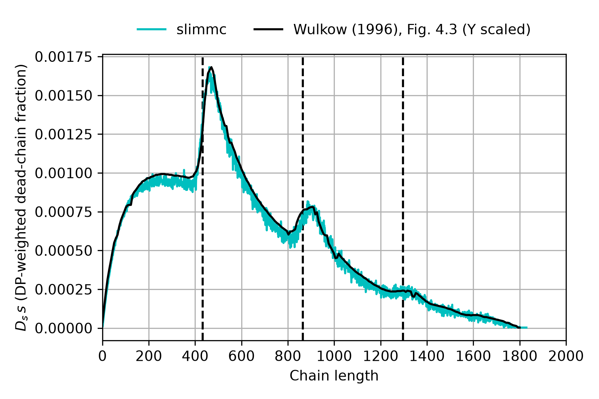

# A02 PLP Wulkow 1996

## 1. Objective

Can Slimmc reproduce the characteristic dead-polymer chain-length distribution shown 
in **Fig. 4.3 of Wulkow [1]** for pulsed-laser polymerization (PLP)?

## 2. Model

The Slimmc model follows the kinetic scheme used in [1], with a virtual monomer `M`, primary radicals `R`, 
active polymer chains `P`, and dead polymer chains `D`. The mechanism includes initiation, propagation, 
and termination by disproportionation.

```code
desc "Modeling of molecular weight distribution in pulsed laser free-radical homopolymerizations"

param seed 1000
param kmc_volume 1e-11
param t_end 1.6
param output_dir "results"

# virtual monomer: [M]0 = 9 mol/L, m.w. = 1 g/mol
monomer M 9 1
species R 0
polymer P active
polymer D dead

rate ki 120
rate kp 120

# termination by disproportionation only
rate ktc 0
rate ktd 3e7

macro init R + M -> P ki
macro prop P + M -> P kp
macro term_c P + P -> D ktc
macro term_d P + P -> D + D ktd

# four laser pulses, t0 = 0.4 s
# each pulse activates 1e-7 mol/L primary radicals
from 0.0 repeat 4 every 0.4 add_c R 1e-7

every 0.4 print_info

# Fig. 4.3 corresponds to t = 4 t0 = 1.6 s
at 1.6 save
at 1.6 save_chains
```

Each laser pulse is represented as an instantaneous addition of `1e-7 mol/L` primary radical. 
Four pulses are applied at intervals of `t0 = 0.4 s`, and the dead-chain distribution is evaluated at `t = 4t0 = 1.6 s`.

## 3. Parameters

| Parameter | Value | Origin |
|---|---:|---|
| `[M]0` | 9 mol/L | [1] |
| `M_M` | 1 g/mol | assumed virtual value |
| `ki` | 120 L/(mol s) | set equal to the initiation coefficient used in the kinetic scheme of [1] |
| `kp` | 120 L/(mol s) | [1] |
| `ktc` | 0 L/(mol s) | [1]; combination disabled |
| `ktd` | 3e7 L/(mol s) | [1] |
| radical increment | 1e-7 mol/L per pulse | [1] |
| pulse interval `t0` | 0.4 s | [1] |
| pulse repetition rate | 2.5 Hz | calculated from `1/t0` |
| number of pulses | 4 | Fig. 4.3 of [1] |
| `t_end` | 1.6 s | calculated as `4 t0` |
| `kmc_volume` | 1e-11 L | numerical simulation setting |
| `seed` | 1000 | numerical simulation setting |

The theoretical chain-length increment between successive PLP features is

`L0 = [M] t0 kp`

which gives

`L0 = 9 * 0.4 * 120 = 432`.

The theoretical inflection points therefore occur at integer multiples of `L0`, i.e. approximately at DP 432, 864, 1296, and 1728.

## 4. Comparison with literature

The reproduction target is the dead-polymer chain-length distribution shown in **Fig. 4.3 of [1]**, 
after four laser pulses at `t = 4t0`. The distribution in [1] is presented in weight representation, 
proportional to `D_s s`, where `D_s` is the concentration of dead chains of length `s`. 
In slimmc, the corresponding distribution is obtained as a mass-weighted absolute CLD using the virtual repeat-unit molar mass of 1 g/mol.



## 5. Remarks

The slimmc-calculated dead-chain distribution reproduces the characteristic PLP structure of Fig. 4.3 of [1], 
including the strong first feature and the subsequent features near integer multiples of `L0`.

The vertical reference lines correspond to the theoretical inflection-point positions `n L0`.

## 6. Limitations

The monomer used in [1] is not chemically identified and its molar mass is not specified. 
A virtual repeat-unit molar mass of `1 g/mol` is therefore used in slimmc, 
making the calculated mass weighting directly proportional to `D_s s`. 
Consequently, the absolute `kg/moL` scale reported in Fig. 4.3 cannot be reproduced unambiguously.

The reference curve was digitized from Fig. 4.3 of [1], introducing a small digitization uncertainty.

## 7. References

[1] M. Wulkow, “PREDICI - A Software Package for Real-life Polymerisation Kinetics,” 
in *Progress in Industrial Mathematics at ECMI 94*, H. Neunzert (ed.), John Wiley & Sons / B. G. Teubner, 1996, pp. 166–175.
