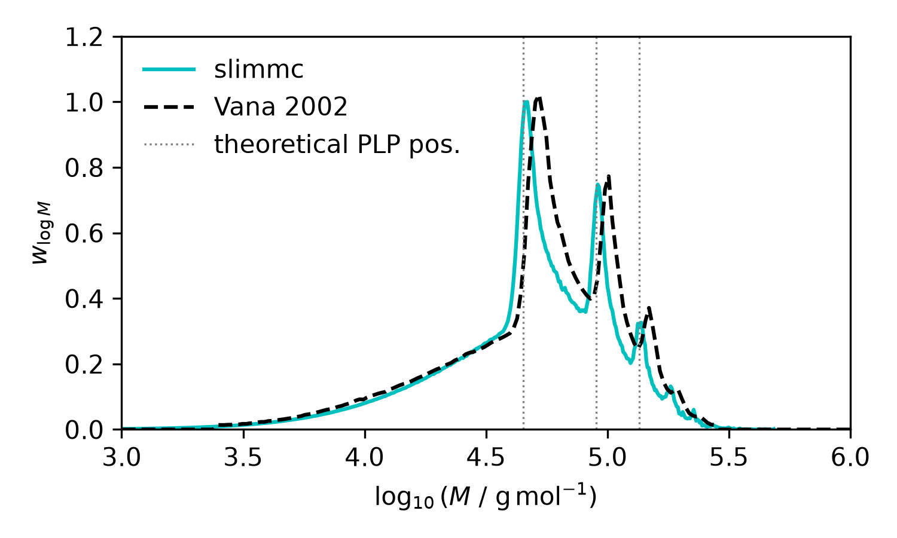
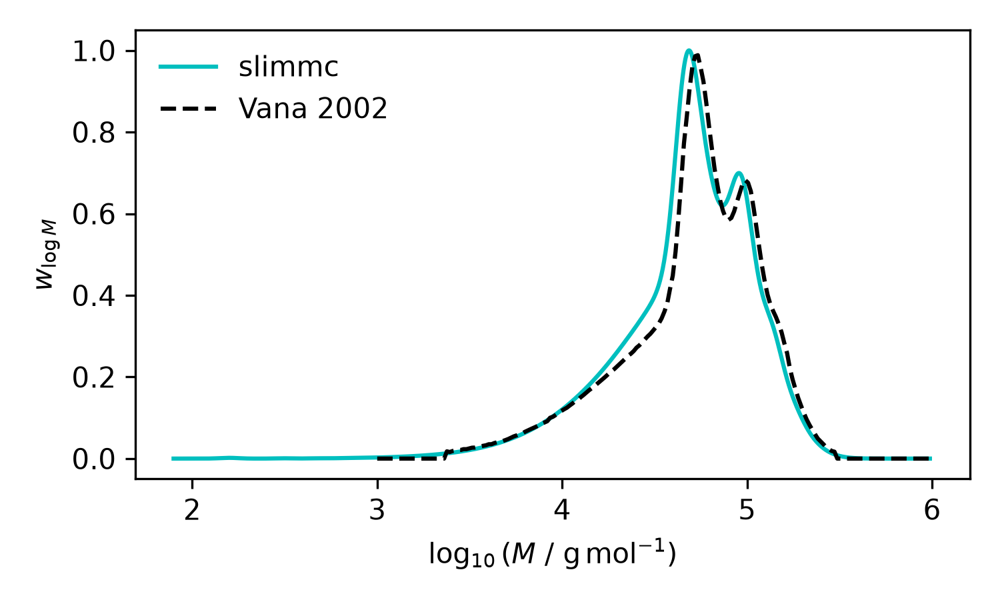

# A03 PLP Vana 2002

## 1. Objective

Validation of slimmc against the molecular-weight distributions reported by Vana et al. [1] for 
pulsed-laser polymerization (PLP) of dimethyl itaconate (DMI) at 40 °C.
The comparison includes the simulated distribution shown in Fig. 3 and the SEC-broadened distribution shown in Fig. 4.

## 2. Model

The Slimmc model follows the kinetic scheme used by Vana et al. [1], including initiation, propagation, termination by combination and disproportionation, primary-radical termination, and transfer to monomer.

```code
desc "PLP DMI, Vana et al. 2002, Fig. 3"

param kmc_volume 1.0e-13
param temperature 313.15
param t_end 50.0
param max_steps 100000000000
param seed 12345
param mass_model repeat_units
param output_dir "results"

# Dimethyl itaconate, bulk at 40 C
# [M] = density / molar mass = 1124 / 158.15 mol/L
monomer DMI 7.107 158.15

# Primary radicals generated by laser pulses
species R 0.0
polymer P active
polymer D dead

# Kinetic parameters, L mol-1 s-1
rate ki  160
rate kp  16

# Vana et al. Fig. 3: ktc=6.0e4, ktd=5.4e5 L mol-1 s-1
# Their kt includes the factor 2 for loss of two radicals per termination event
# Slimmc uses reaction-rate k (/2)
rate ktc 3.0e4
rate ktd 2.7e5

rate ktr 5.0e-3
rate k1  1.0e8

# Initiation and propagation
macro init R + DMI -> P ki
macro prop P + DMI -> P kp

# Termination
macro term_c P + P -> D ktc
macro term_d P + P -> D + D ktd

# Primary-radical termination
macro term_x P + R -> D k1

# Transfer to monomer
macro transfer_m P + DMI -> D + P ktr

# Laser pulses:
# 20 pulses, repetition rate 0.4 Hz -> period 2.5 s
# total time -> 20 x 2.5 = 50 s
# each pulse generates F = 1.54e-6 mol/L primary radicals
from 0.0 repeat 20 every 2.5 add_c R 1.54e-6

# Store final chain population
at 50.0 save
at 50.0 save_chains

every 1 print_info
```

Twenty instantaneous laser pulses are applied at intervals of `t0 = 2.5 s`. 
Each pulse generates `F = 1.54e-6 mol/L` primary radicals, as specified for Fig. 3 of [1].

## 3. Parameters

| Parameter | Value | Origin |
|---|---:|---|
| `[DMI]0` | 7.107 mol/L | bulk DMI; calculated from 1124 g/L and 158.15 g/mol |
| `M_DMI` | 158.15 g/mol | DMI molar mass |
| `T` | 313.15 K | 40 °C, [1] |
| `ki` | 160 L/(mol s) | Table 4 of [1] |
| `kp` | 16.0 L/(mol s) | [1] |
| `ktc` | 3.0e4 L/(mol s) | Fig. 3 value divided by 2 for Slimmc reaction-rate convention |
| `ktd` | 2.7e5 L/(mol s) | Fig. 3 value divided by 2 for Slimmc reaction-rate convention |
| `ktr` | 5.0e-3 L/(mol s) | Table 4 of [1] |
| `k1` | 1.0e8 L/(mol s) | Table 4 of [1] |
| radical increment `F` | 1.54e-6 mol/L per pulse | Fig. 3 of [1] |
| pulse interval `t0` | 2.5 s | Fig. 3 of [1] |
| pulse repetition rate | 0.4 Hz | calculated from `1/t0` |
| number of pulses | 20 | [1] |
| `t_end` | 50 s | `20 t0` |
| `kmc_volume` | 1.0e-13 L | numerical simulation setting |
| `seed` | 12345 | numerical simulation setting |

Vana et al. use a termination coefficient that includes the factor of two for disappearance of two radicals per termination event. 
Slimmc uses a reaction-event rate constant for `P + P` termination, therefore the literature values are divided by two.

The characteristic PLP chain-length increment is

`L0 = kp [M] t0`

which gives

`L0 = 16.0 * 7.107 * 2.5 = 284.28`.

The first three theoretical PLP positions are therefore approximately at DP 284, 569, and 853.

## 4. Comparison with literature

The first comparison uses the simulated molecular-weight distribution shown in Fig. 3 of [1]. The Slimmc MWD is mass-weighted and expressed as `dW/dlog10(M)`. Both curves are normalized to their maxima for shape comparison.



The dotted vertical lines indicate the theoretical PLP positions derived from `n L0`.

The second comparison uses the same simulated distribution after SEC broadening with

`σ(log M) = 0.05`

as applied by Vana et al. in Fig. 4.



After SEC broadening, the Slimmc and literature curves show close agreement in the position and shape of the main peaks and in the high-molecular-weight decay.

## 5. Remarks

The theoretical PLP spacing is reproduced by Slimmc. 
Analysis of the raw dead-chain population gives characteristic structures close to integer multiples of `L0`.
The unbroadened distribution of Fig. 3 shows small differences in the detailed peak shape between Slimmc and the PREDICI result. 

## 6. Limitations

The exact numerical representation used by PREDICI to generate the unbroadened simulated SEC trace in Fig. 3 is not fully specified in [1].
The literature curves were digitized from Figs. 3 and 4 of [1], introducing a small digitization uncertainty. 
The graphical comparison uses normalized Y values and therefore evaluates distribution shape rather than absolute ordinate magnitude.

## 7. References

[1] P. Vana, L. H. Yee, C. Barner-Kowollik, J. P. A. Heuts, and T. P. Davis,  
“Termination Rate Coefficient of Dimethyl Itaconate: Comparison of Modeling and Experimental Results,”  
*Macromolecules*, **35** (2002), 1651–1657.

